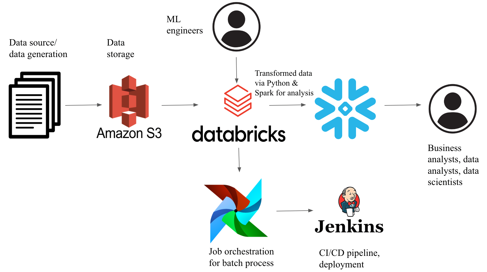
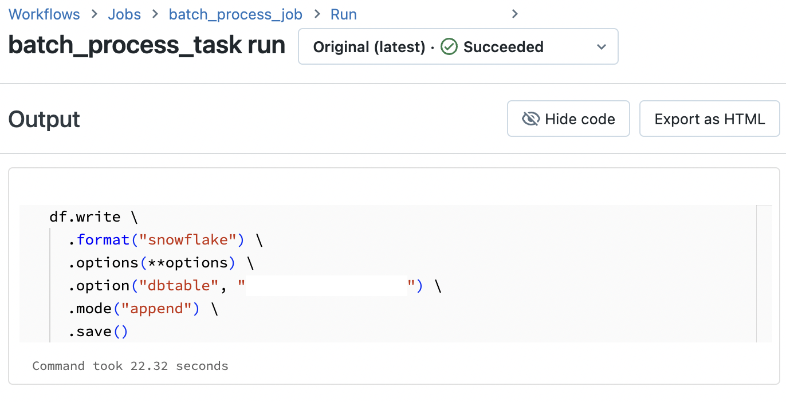
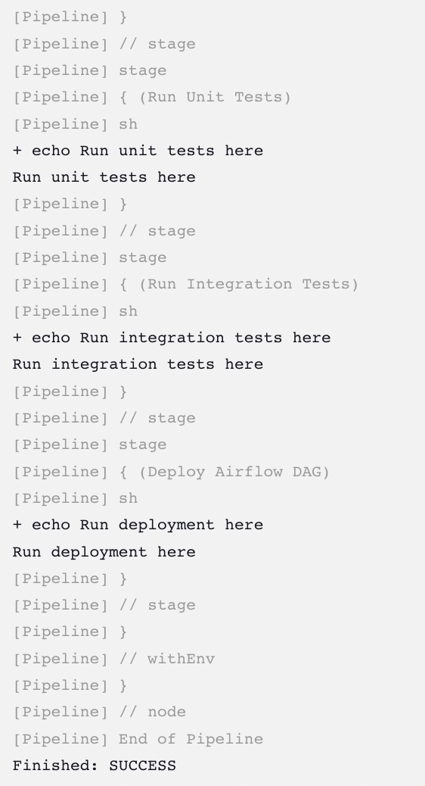

# Batch Processing of User Activity Data for E-commerce Analytics

## Objective 

To experiment with the integration of different technologies to create an end to end batch processing pipeline of user activity data, which can then be used by users such as machine learning engineers and business analysts. 

## Table of Contents
- [Technologies Used](#technologies-used)
- [Architecture Diagram](#architecture-diagram)
- [Project Steps](#project-steps)
  - [Phase 1: Data Ingestion](#phase-1-data-ingestion)
  - [Phase 2: Batch Processing with Spark and Databricks](#phase-2-batch-processing-with-spark-and-databricks)
  - [Phase 3: Data Warehouse (Snowflake)](#phase-3-data-warehouse-snowflake)
  - [Phase 4: Workflow Automation](#phase-4-workflow-automation)
  - [Phase 5: CI/CD Integration](#phase-5-cicd-integration)

## Technologies Used 
SQL (Snowflake)  
Python  
Bash  
Spark (Databricks)  
AWS (S3, EC2)  
Apache Airflow  
Jenkins  
Docker  
Github     

## Architecture Diagram 

## Project Steps 
## Phase 1: Data Ingestion 
In this phase, we are creating an AWS S3 bucket where raw user activity data will be stored and generating that data via a Python script. To send the data to AWS, I also used AWS CLI to configure an AWS profile. 

1. Set Up AWS S3 Bucket & Configure Access To AWS   
    a. Sign in to the AWS Management Console.  
    b. Navigate to the S3 service and create a new bucket.  
    c. Configure bucket permissions and policies.  
    d. Install AWS CLI and configure an AWS profile.     

2. Data Generation  
    a. Write a Python script that simulates user behavior on an e-commerce site. See python script ‘data_generator.py’.  
    b. Upload the generated JSON file into the S3 bucket.  

## Phase 2: Batch Processing with Spark and Databricks

We are setting up a Databricks cluster, configuring S3 access (in this project, with instance profiles), and using Spark to read JSON data from the S3 bucket in the Databricks environment. 

3. Databricks Cluster Setup  
    a. Create a Databricks workspace.  
    b. Provision a Spark cluster within the workspace.  

4. Read Data  
    a. Configure S3 access with instance profiles.  
&nbsp;&nbsp;&nbsp;&nbsp;&nbsp;&nbsp;&nbsp;&nbsp;i. Following Databricks documentation, I created an instance profile within AWS, added permissions, and connected the instance profile to Databricks.  
    b. Load the JSON file into a Spark DataFrame.  
&nbsp;&nbsp;&nbsp;&nbsp;&nbsp;&nbsp;&nbsp;&nbsp;i. Data transformation was not needed in this project since the data was generated but transformation would normally happen in this phase. 

## Phase 3: Data Warehouse (Snowflake)

In this phase, we set up a Snowflake environment, configure Snowflake for Spark in Databricks, and populate Snowflake with the prepared data.     

5. Snowflake Setup  
    a. Create a Snowflake account.  
    b. Set up a database and corresponding tables.  
    c. Configure Snowflake for Spark in Databricks.  
&nbsp;&nbsp;&nbsp;&nbsp;&nbsp;&nbsp;&nbsp;&nbsp;i. Databricks provides a Snowflake connector in the Databricks Runtime to support reading and writing data from Snowflake. Use the Databricks secret manager to set Snowflake user login name and password. 

6. Load Transformed Data  
    a. Use Spark in the Databricks notebook to load the transformed data from Databricks into Snowflake.

## Phase 4: Workflow Automation

We are automating the batch process seen in the last phase using Airflow. This involves setting up Airflow in Docker allowing Databricks integration, writing the DAG, and configuring Databricks jobs with Airflow.   

7. Airflow DAG  
    a. Set up Airflow in Docker and install the Databricks provider packages.   
    b. Write an Airflow DAG that orchestrates the batch process. See my dag in ‘batch_processing_dag.py’.  
&nbsp;&nbsp;&nbsp;&nbsp;&nbsp;&nbsp;&nbsp;&nbsp;i. I used the DatabricksRunNowOperator which requires an existing Databricks job.   
    c.Configure Databricks jobs with Airflow to ensure successful DAG run.   
&nbsp;&nbsp;&nbsp;&nbsp;&nbsp;&nbsp;&nbsp;&nbsp;i. Create a job in Databricks attaching the respective notebook. Use the job ID in the DAG script. Use the Databricks personal access token when configuring a Databricks connection to Airflow - I used the web UI for this instance.  
&nbsp;&nbsp;&nbsp;&nbsp;&nbsp;&nbsp;&nbsp;&nbsp;ii. See successful runs in the Airflow web UI or Databricks.   
  
  

## Phase 5: CI/CD Integration

We create a CI/CD pipeline and run it in a containerized Jenkins set up. For ease of resources and to focus on Jenkins integration, the pipeline is more simplistic in my project and the steps act as placeholders for additional code.   

8. Jenkins Setup   
    a. Install Jenkins.   
&nbsp;&nbsp;&nbsp;&nbsp;&nbsp;&nbsp;&nbsp;&nbsp;i. In my project, I also ran it in Docker.   
    b. Create a Jenkinsfile.   
&nbsp;&nbsp;&nbsp;&nbsp;&nbsp;&nbsp;&nbsp;&nbsp;i. See ‘Jenkinsfile’.   
    c. Create a new job in Jenkins and configure using the pipeline script from SCM option.   
&nbsp;&nbsp;&nbsp;&nbsp;&nbsp;&nbsp;&nbsp;&nbsp;i. Add Github credentials using the secret key option in Jenkins.   
    d. Run the pipeline.   
&nbsp;&nbsp;&nbsp;&nbsp;&nbsp;&nbsp;&nbsp;&nbsp;i. See below a sample output of a successful build.  

  
